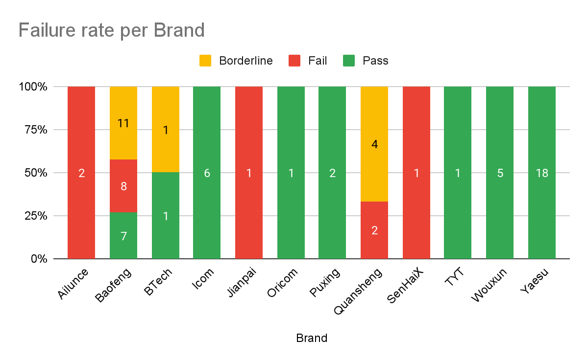
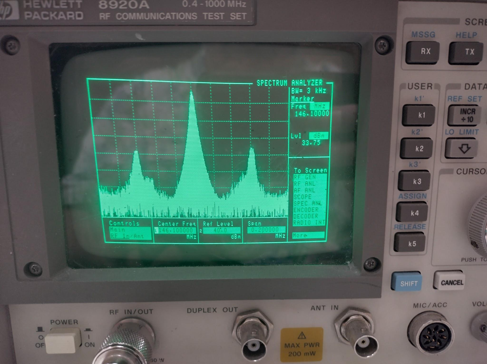
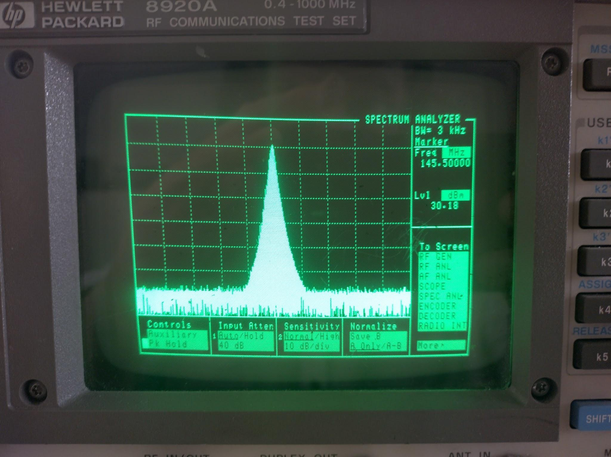

# Radio Harmonic Power
## in low power amateur radio handhelds
(tests conducted in August 2023)

Authors:

Onno Benschop VK6FLAB

Glynn Davies VK6PAW

Randall Wayth VK6WR

# Executive Summary

Inexpensive amateur radio transceivers are in common use around the
world. There is a perception that many, if not all such radios are
non-compliant in relation to spurious emissions. The authors set out to
test this using a Hewlett Packard 8920A RF Communications Test Set
capable of testing 400 kHz to 1 GHz.

RF emissions were tested on the 2m amateur band and readings at the
second and third harmonics were recorded.

The tests across a range of brands and models reveal that:

-   All \"name brand\" radios were compliant, none were close to
    borderline.

-   All radios from brands sold in Australia by Australian distributors
    were compliant.

-   The Baofeng radios constitute the largest sample of the inexpensive
    radios, and of these 7 out of the 26 tested were compliant, 8 were
    non-compliant and a further 11 were borderline.

-   The small sample size of the radios purchased online prevent
    conclusions being made about specific brands, however it is
    noteworthy that collectively about half were compliant.

There is an assumption that factory supplied equipment is fit for
purpose and operates within regulations, but these tests show that this
is often not the case. Radio amateurs today have access to a wide
variety of transmitters which are often operated within that assumption.
As a result, and despite readily having access to inexpensive and
quality testing equipment, such transmitters are inadvertently operated
outside the regulatory requirements.

Our findings show that any radio purchased from an Australian
distributor appears to have passed the regulatory requirements and the
adage that "you get what you pay for" bears out.

This report also includes a section on interpretation of results for
those who would like to understand their personal test results.

# Introduction

Radio transmitters are available across the world in a bewildering
variety and price point. For years there has been an influx of cheap
radios and the price conscious radio amateur community has embraced
these new entrants with enthusiasm.

Several amateurs have observed that some of these radios are not
performing within the specifications[^1] outlined for amateur radio
equipment by the International Telecommunications Union, the ITU, let
alone more stringent requirements imposed by various jurisdictions[^2].

Several tests have been conducted both formally and informally by
individual amateurs[^3] as well as organisations like the American Radio
Relay League[^4], the ARRL, the peak body for amateur radio in the
United States.

As a result, an often repeated statement is that "cheap Chinese radios
are non-compliant".

Given that such radios are often a first introduction to the amateur
radio hobby, the authors set out to test if this sentiment was
universally applicable or not.

# Summary of test equipment and setup

Testing was conducted using a Hewlett Packard 8920A RF Communications
Test Set capable of testing 400 kHz to 1 GHz. Tests were performed using
the RF In/Out port, rated at 60 Watts continuous power using 40 dB of
attenuation.

Radio power output was measured on the "TX" screen, set to "Tune Mode:
Auto". Any frequency difference between the radio display and the test
set was noted.

Power output at the fundamental, second and third harmonic frequencies
were measured using the "SPEC ANL" screen. Frequencies were manually
entered and make, model and power readings were manually recorded onto
sheets of paper and later transcribed into a Google Spreadsheet for
analysis. Radio owners were supplied with a copy of the measurements.

The majority of measurements were made on "testing day", during the
local Northern Corridor Radio Group annual HAMfest, held on Sunday, 20
August 2023 at the Cyril Jackson Recreation Centre. Visitors were
encouraged to bring their handheld radio for testing purposes.

Visitors were encouraged to set their radio to the Australian 2m FM
calling frequency of 146.500 MHz where possible, to disable any CTCSS or
DCS tone and to disable any repeater offset.

Testing consisted of the following process:

-   The antenna was removed and a 1 metre long coax patch lead was
    attached (including any adaptors to SMA if required). The patch
    lead was then connected to the HP Test Set.

-   With the test set on the \"TX\" (transmitter test overview) screen,
    the transmitter was triggered and readings recorded.

-   With the test set on the \"SPEC ANL\" (spectrum analyser) screen,
    for each of the relevant frequencies, the frequency was entered,
    the transmitter was triggered and readings recorded.

-   The radio was disconnected.

-   The recorded readings were transcribed onto a separate sheet which
    was provided to the owner of the radio.

Prior to testing day 16 tests were conducted to validate the process.

On testing day 54 tests were conducted.

Subsequent to testing day, 4 additional tests were made using the same
process.

In all, 39 distinct models of radio were tested.

## Notes

For several radios more than one test was conducted at different power
levels or frequency ranges.

The test set has not been calibrated recently and the authors observed
that there was a 3 dB difference between the total power reading on the
"TX" screen when compared to the power reading on the "SPEC ANL" screen.
Given that the readings of interest are relative, rather than absolute,
this was not considered a factor in this report.

# Classification (quantitative) of misbehaving radios and justification of classification

We used the Australian regulations for spurious emissions from radios to
set the threshold for classification of a radio\'s performance, which
are consistent with ITU guidelines. Specifically, for transmitters with
power less than 500 Watts[^5] spurious emissions must have a power level
lower than the fundamental (in dB) defined by 43 + 10log10(P), where P
is the power of the fundamental in Watts. For a 5 Watt radio, this
formula yields 50 dB, hence the spurious emission limit is 5 Watt = 37
dBm - 50 = -13 dBm.

Given the measurement and calibration uncertainties of the test
equipment noted above, we also define a less stringent threshold,
relaxed by 6 dB[^6]. This allows devices that have emissions that just
exceed the limit to be classified as \"borderline\".

# Analysis

Chart 1 provides a summary of the radios tested by brand. The chart
shows that we received a good sample covering \"name brands\" as well as
new and inexpensive brands. In particular we received a good sample of
Baofeng, Yaesu and Icom radios.

In Australia, the following brands are sold by Australian distributors:
Icom, Yaesu, Wouxun, TYT. Other models are purchased via generic web
retailers.

**Chart 1**: Breakdown of the number of tests conducted per brand.

Chart 2 provides a summary of the test results by brand, categorised
into pass, fail and borderline.

**Chart 2**: Breakdown of Pass / Failure and Borderline tests per brand.

We note the following:

-   All \"name brand\" radios were compliant, none were close to
    borderline.

-   All radios from brands sold in Australia by Australian distributors
    were compliant.

-   The Baofeng radios constitute the largest sample of the inexpensive
    radios, and of these 7 out of the 26 tested were compliant, 8 were
    non-compliant and a further 11 were borderline.

-   The small sample size of the radios purchased from online retailers
    prevent conclusions being made about specific brands, however it
    is noteworthy that collectively about half were non-compliant.

# Examples of Spectrum Analyzer Screen

**Image 1**: This is an example of an FM transmitter that is creating
spurious emissions.

**Image 2**: This is an example of an FM transmitter that is compliant.

# Discussion

It is noteworthy that 5 of the Baofeng radios tested and the one Jianpai
radio had second harmonics less than 20 dB below the fundamental, i.e.
they are highly non-compliant. These radios are examples of the very
poorly performing units, similar to those that have been highlighted in
individual anecdotal cases. Based on our sample, nearly 20% of the
Baofeng radios tested were so poorly performing, which is concerning.

There is an assumption that factory supplied equipment is fit for
purpose and operates within regulations, but these tests show that this
is often not the case. Radio amateurs today have access to a wide
variety of transmitters which are often operated within that assumption.
As a result, and despite readily having access to inexpensive and
quality testing equipment, such transmitters are inadvertently operated
outside the regulatory requirements.

Our findings show that any radio purchased from an Australian
distributor appears to have passed the regulatory requirements and the
adage that \"you get what you pay for\" bears out.

During the production of this report the authors received some
uncorroborated commentary which on further examination appear to have
merit. They are included here, without proof or reference, for potential
further study.

It was suggested that some radios failed emission standards after
suffering damage in the output filtering stages in some unspecified way.
A cursory glance at a circuit diagram for one radio suggests that this
is a plausible failure mode where a simple capacitor failure might cause
a filter to fail without preventing the transmitter to operate. Further
investigation might centre on how such a failure might occur and if such
failures actually cause out of regulation behaviour.

Another suggestion was that some radios might use a specifically
designed antenna to suppress the second harmonic. Given that some radios
failed only on the second harmonic spurious emission requirement, but
not the third, this seems plausible. The authors note that all tested
radios had removable antennas and compliance is set at the transmitter
output, not at the antenna output. It could be argued that if an antenna
was not detachable, this construction might be construed to meet the
emission requirements. It does raise a more interesting question, what
is the impact of fitting aftermarket antennas to such radios in relation
to their on-air behaviour?

Finally, during testing the authors were asked why we were not
conducting deviation testing. The authors considered this as an option,
but reached the conclusion that given the wide range of radios expected
to be tested, there was no[^7] single, or simple, way to conduct a
standard test across all handsets. There is potential for exploring this
further, especially since it's clear from actual on-air use of these
radios that deviation does not appear to be standardised across models
or brands.

# Interpreting the results of a test

Visitors to "testing day" who offered their radio(s) for testing were
supplied with a report card. To understand the results and determine if
your radio is compliant with the regulations, we offer the following
guide.

Please note that this is not a certification, the authors make no
warranties, implied or otherwise, that the results are accurate in
respect to your specific handset and we note that there is a 3 dB
difference between the Power reading and the Primary output reading when
both should be the same.

Given that the threshold value is calculated using the supplied power
reading in Watts and the differences between the harmonics are measured
in dBm from the same screen we have a high level of confidence that the
results are representative.

For some radios, testing was conducted on the 70cm amateur band and
given the maximum frequency of the testing equipment were only tested on
the second harmonic.

For some radios, testing was conducted using several power levels and
the results of the following will likely vary for each power level.

For some radios, testing was conducted on the 6m amateur band. This
frequency is greater than 30 MHz specified in the compliance regulations
and the following calculations also apply.

To determine compliance, calculate the following:

-   Using the value in the Watts field, calculate the **compliance
    threshold** using the formula: 43 + 10log10(P)

-   Using the primary dBm reading, subtract the calculated threshold
    value to get the **maximum permitted harmonic level**.

-   Using the measurements for the secondary and third harmonics and
    compare these to the maximum permitted harmonic level.

    -   If both harmonics are **less** than the maximum permitted
        harmonic level, the radio is **compliant**.

    -   If any harmonic is **greater** than the maximum permitted
        harmonic level, the radio is **non-compliant**.

    -   If either harmonic is greater than the maximum permitted
        harmonic level, but the difference is less than 6 dB, we
        categorise the radio as borderline compliant.

# Worked Examples

Below you'll find examples of test results and the method used to
determine if the results indicate a radio that's compliant or not. Note
that in this report we have created a relaxed category which we've
called "borderline", describing results that do not meet the level of
"compliant", but their non-compliance is less than 6 dB from the
permissible level. This does not mean that a radio that is determined to
be "borderline" is actually compliant, but within the margins of error
introduced by our tests, it could be. In other words, do your own tests
and draw your own conclusions.

## Example of compliance:
This is an example of a compliant radio across both second and third
harmonics.

| **Power (W)**     | **Primary (dBm)** | **Second (dBm)**  | **Third (dBm)**   |
| :---------------: | :---------------: | :---------------: | :---------------: |
| 4.69              | 33.75             | -27.79            | -26.28            |

-   Using the power reading (4.69 Watts), the threshold value is: 43 +
    10 \* log10(4.69) = 49.71 dB

-   Subtract the threshold value from the primary output (33.75 dBm):
    33.75 - 49.71 = -15.96 dBm

-   The second harmonic (-27.79 dBm) is less than -15.69 dBm (by -11.83
    dB)

-   The third harmonic (-26.28 dBm) is less than -15.69 dBm (-10.32 dB)

-   This radio is compliant for both harmonics.

## Example of non-compliance:

This is an example of a non-compliant radio. The third harmonic is not
compliant and the difference between compliance and non-compliance is
greater than 6 dB, in this case, the difference is 10 dB.

| **Power (W)**     | **Primary (dBm)** | **Second (dBm)**  | **Third (dBm)**   |
| :---------------: | :---------------: | :---------------: | :---------------: |
| 5.44              | 34.36             | -23.00            | -6.00             |

-   Using the power reading (5.44 Watts), the threshold value is: 43 +
    10 \* log10(5.44) = 50.36 dB

-   Subtract the threshold value from the primary output (34.36 dBm):
    34.36 - 50.36 = -16.00 dBm

-   The second harmonic (-23.00 dBm) is less than -16.00 dBm (by -7 dB)

-   The third harmonic (-6.00 dBm) is greater than -16.00 dBm (by 10 dB,
    greater than 6 dB)

-   This radio is non-compliant for the third harmonic and the
    difference is greater than 6 dB. This radio is non-compliant.

## Example of borderline-compliance:

This is an example of a radio that is non-compliant on either harmonic,
but the difference between compliance and not is less than 6 dB. We
categorised this as a borderline compliant radio.

| **Power (W)**     | **Primary (dBm)** | **Second (dBm)**  | **Third (dBm)**   |
| :---------------: | :---------------: | :---------------: | :---------------: |
| 4.73              | 33.30             | -14.50            | -12.30            |

-   Using the power reading (4.73 Watts), the threshold value is: 43 +
    10 \* log10(4.73) = 49.75 dB

-   Subtract the threshold value from the primary output (33.30 dBm):
    33.30 - 49.75 = -16.45 dBm

-   The second harmonic (-14.50 dBm) is greater than -16.45 dBm (by 1.95
    dB, less than 6 dB)

-   The third harmonic (-12.30 dBm) is greater than -16.45 dBm (by 4.15
    dB, less than 6 dB)

-   This radio is non-compliant for both harmonics, but the difference
    is less than 6 dB, this radio is borderline compliant.

[^1]: ITU specification which also includes examples on how to apply the
    rules: "Recommendation ITU-R SM.329-10" - "Unwanted emissions in the
    spurious domain"
    [[https://www.itu.int/dms_pubrec/itu-r/rec/sm/R-REC-SM.329-10-200302-S!!PDF-E.pdf]{.underline}](https://www.itu.int/dms_pubrec/itu-r/rec/sm/R-REC-SM.329-10-200302-S!!PDF-E.pdf)

[^2]: FCC specification has stricter requirements than the ITU and makes
    exceptions for equipment of different ages:
    [[https://www.govinfo.gov/content/pkg/CFR-2010-title47-vol5/pdf/CFR-2010-title47-vol5-sec97-307.pdf]{.underline}](https://www.govinfo.gov/content/pkg/CFR-2010-title47-vol5/pdf/CFR-2010-title47-vol5-sec97-307.pdf)

[^3]: Hayden VK7HH tests a UV5R3:
    [[https://www.youtube.com/watch?v=bQyyBnEzrY4]{.underline}](https://www.youtube.com/watch?v=bQyyBnEzrY4)

[^4]: ARRL QST, November 2015 "ARRL Laboratory Handheld Transceiver
    Testing":
    [[https://www.nf9k.net/wp-content/uploads/2016/05/ARRL-Lab-HT-Testing.pdf]{.underline}](https://www.nf9k.net/wp-content/uploads/2016/05/ARRL-Lab-HT-Testing.pdf)

[^5]: From 500 Watts the emission requirement peaks at 70 dB.

[^6]: We have chosen 6 dB based on a 3 dB random measurement error and 3
    dB to allow for a systematic error associated with any potential
    calibration errors.

[^7]: Tests of this nature require that a known input generates a
    measured output. This means that each radio would need to be
    physically connected via its microphone input to the testing
    equipment. Making such an interface for one radio is feasible, but
    quickly becomes a project in itself when considering the variation
    in connectors, polarity, impedance, and potential microphone bias
    voltages.
